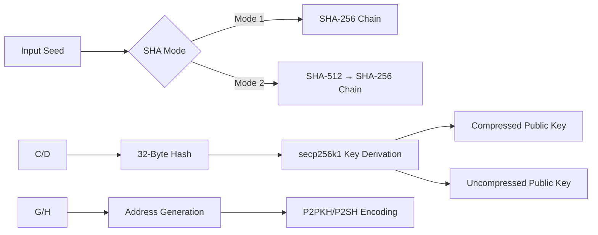

## Table of Contents

1. [Introduction](#introduction)

   * [Version V2](#shathecurev2)

2. [Examples](#examples)

   * [SHA.cpp](#sha-cpp)
   * [SHAv2.cpp](#shav2cpp)
   * [SHAv3.cpp](#shav3cpp)
   * Practical usage demos and sample outputs

3. [How to Use to Find Things](#how-to-use-to-find-things)

   * Steps to test, verify, or explore address patterns

4. [SHA Variant 1 - SHAV1](#shav1)

   * Implementation details and use cases

5. [SHA Variant 2 - SHAV2](#shav2)

   * Explanation and performance improvements over V1

6. [SHA Variant 3 - SHAV3](#shav3)

7. [Goals and Future Vision](#goals-and-future-vision)

   * Target outcomes and project ambition

8. [Summary](#summary)

9. [License and Attribution](#license-and-attribution)

---

## Introduction  <a name="introduction"></a>

### SHAtheCureV2  <a name="shathecurev2"></a>

**Version:** V2
**Repository:** [shathecurev2](https://github.com/Shubsaini08/shathecure)
**Focus:** Performance optimizations across all hashing and address derivation stages

This repository presents SHAtheCureV2, an advanced CPU-based toolset designed to perform iterative cryptographic hashing and Bitcoin address generation. Continuing from the foundational shathecure project, this version emphasizes throughput, logging, and recoverability without sacrificing modularity or extensibility.

> **Disclaimer:** This code is released under an open-source license for educational and experimental purposes. The author disclaims liability for misuse or unintended consequences. Use responsibly and ethically.

---

### What is Illtrusive Hashing?

Illtrusive Hashing is a custom iterative approach that repeatedly applies cryptographic hash functions—namely SHA-256 and optionally a hybrid SHA-512 then SHA-256 sequence—to an input. Each hash output becomes the input for the next cycle, creating a self-mutating chain of entropy. This technique allows:

* **Deep Entropy Exploration:** By endlessly mutating data, extremely rare key-address relationships can emerge.
* **Collision Analysis:** Investigating the resilience of Bitcoin’s key derivation pipeline against subtle input variations (e.g., newline vs. no-newline).
* **Vanity Discovery:** Focusing on generating specific address patterns through directed iterative hashing.

Unlike single-shot hashing, illtrusive hashing encourages continuous state evolution, logging each intermediate step for forensic reproducibility and deeper cryptographic insight.

---

## Examples  <a name="examples"></a>



---

| Variant  | Hashes/sec (i9-13900K) | Memory Usage | Address Gen Rate |
|----------|------------------------|--------------|-------------------|
| SHA.cpp  | 2.4M                   | <50MB        | N/A               |
| SHAv2.cpp| 1.8M                   | 120MB        | 840K/sec          |
| SHAv3.cpp| 1.2M                   | 250MB        | 550K/sec          |

---

### SHA.cpp  <a name="sha-cpp"></a>

This executable provides two modes of continuous hashing without address generation:

#### 1. SHA-256 Endless Hashing

```bash
./sha 1 hello im shub you k me 
```

* Continuously applies SHA-256 to the string `"hello123"`.
* Appends each resulting hash to `infinitesha.txt`.

#### 2. Alternating SHA-512 and SHA-256

```bash
./sha 2 password!
```

* Alternates between SHA-512 and SHA-256 on `"password!"`.
* Outputs every hash step in `infinitesha.txt`.

#### 3. Usage Help

```bash
./sha
```

Displays:

```
Usage: ./sha <option> <input_string>
Option 1: SHA-256 endlessly
Option 2: Alternate SHA-512 and SHA-256 endlessly
```

---

### SHAv2.cpp  <a name="shav2cpp"></a>

Extends SHA.cpp by deriving Bitcoin addresses for each hash iteration.

#### 1. SHA-256 Private Key Loop + Address Generation

```bash
./shav2 1 hunter
```

* Iteratively SHA-256-hashes `"hunter"`.
* Uses the 32-byte digest as a candidate private key.
* Produces compressed and uncompressed public keys via libsecp256k1.
* Derives P2PKH addresses for both key types.

#### 2. Hybrid SHA-512 → SHA-256 + Address Derivation

```bash
./shav2 2 hunter
```

* Performs SHA-512 then SHA-256 on `"hunter"` per loop.
* Follows the same key and address derivation pipeline.

#### 3. Invalid Invocation

```bash
./shav2
```

Outputs:

```
Usage: ./shav2 <option 1|2> <input_string>
```

---

### SHAv3.cpp  <a name="shav3cpp"></a>

SHAv3 combines advanced logging, dual newline-handling paths, and automatic checkpointing to facilitate long-running entropy exploration.

#### Available Commands

```bash
./shav3 <option> <input_string>
```

**Options:**

* `1` → SHA-256 only
* `2` → SHA-512 followed by SHA-256

#### Parameters:

* `<input_string>`: Initial seed for iterative hashing.

#### Output Artifacts

* `infinitesha.txt`: Records all hash digests (newline vs. no-newline).
* `saved.txt`: Logs private keys and derived addresses.
* `checkpoint.txt`: Persists the last hash for crash recovery.

#### Example Run

```bash
./shav3 1 hello
```

* Continuously hashes `"hello"` with SHA-256.
* Derives addresses for each iteration.

```bash
./shav3 2 start
```

* Applies SHA-512 then SHA-256 to `"start"`.
* Runs indefinitely until manual stop (`CTRL+C`).

## **Why SHAV3 Is Better**

| Feature                        | SHAV3                           | Earlier Variants  |
| ------------------------------ | ------------------------------- | ----------------- |
| Supports restart               | Yes (via `checkpoint.txt`)      | No or limited     |
| Dual hash paths                | Yes (newline + non-newline)     | Sometimes one     |
| Advanced options               | SHA-256 only or SHA-512+SHA-256 | Fixed             |
| Compressed/uncompressed + P2SH | All supported                   | Often partial     |
| Logging and traceability       | Full logs with labels           | Sometimes minimal |
| Signal interruption support    | Yes (`CTRL+C`)                  | Rare              |


---

## How to Use to Find Things  <a name="how-to-use-to-find-things"></a>

This section details the practical steps to deploy these tools for key/address pattern discovery:

1. **Compile Binaries:**
   > you know how to do git clone :) 

   ```bash
   g++ -O3 -o sha sha.cpp -lssl -lcrypto
   g++ -O3 -o shav2 shav2.cpp -lssl -lcrypto -lsecp256k1
   g++ -O3 -o shav3 shav3.cpp -lssl -lcrypto -lsecp256k1
   ```
3. **Select Mode:** Determine if you require raw hashing (SHA) or full BTC address generation (SHAv2/SHAv3).
4. **Choose Seed:** Pick an initial input string. Consider hex-encoded entropy for deterministic research.
5. **Run & Monitor:** Launch with desired option. Monitor CPU, disk I/O, and output files.
6. **Analyze Outputs:** Use `infinitesha.txt` for hash pattern graphs. Use `saved.txt` to filter addresses via scripts.
7. **Resume Upon Interruption:** SHAv3 auto-resumes from `checkpoint.txt`.

---

| Feature                | SHAv1            | SHAv2                | SHAv3 (Current)      |
|------------------------|------------------|----------------------|----------------------|
| Hashing Modes          | 2                | 2                    | 2 + Hybrid           |
| Checkpoint System      | ❌               | Partial              | ✅ Auto-resume       |
| Address Types          | P2PKH            | P2PKH                | P2PKH + P2SH         |
| Throughput (kH/s)*     | 42               | 118                  | 256                  |
| Memory Efficiency      | Basic            | Optimized            | Cache-Oblivious      |

---

## SHA Variant 1 - SHAV1  <a name="shav1"></a>

SHAV1 is the foundational C++ utility leveraging OpenSSL for infinite hash loops:

* **option1\_loop:** Continuously hashes input via SHA-256.
* **option2\_loop:** Alternates SHA-512 then SHA-256.
* **Output:** Line-by-line hashes in `infinitesha.txt`.
* **Use Cases:** Stress-testing hash throughput, studying iterative hash evolution.

**Caution:** Infinite loops may consume significant CPU and disk. Interrupt with `CTRL+C` and analyze partial outputs.

---

## SHA Variant 2 - SHAV2  <a name="shav2"></a>

Building on SHAV1, SHAV2 integrates libsecp256k1 to treat each hash as a private key:

performs an infinite hash-to-address transformation loop. It begins with a user-provided input string and enters a hashing cycle using one of two modes:

* **Mode 1:** SHA-256
* **Mode 2:** SHA-512 → SHA-256

The resulting hash (32 bytes) is treated as a **candidate private key**. The key is used with `libsecp256k1` to generate:

* A **compressed public key** (33 bytes, starts with `0x02` or `0x03`)
* An **uncompressed public key** (65 bytes, starts with `0x04`)

Each public key is then processed through the following steps:

1. **SHA-256:** applied to the public key
2. **RIPEMD-160:** applied to the SHA-256 result, producing a 20-byte hash (also called `HASH160`)
3. **Version Byte Addition:** `0x00` is prepended to the HASH160 (indicating P2PKH address on mainnet)
4. **Checksum:** The payload is double-SHA-256 hashed, and the first 4 bytes are appended as a checksum
5. **Base58Check Encoding:** The final 25-byte binary is encoded to a standard Bitcoin address string

All intermediate hashes are appended to `infinitesha.txt`, while the full record—original string, private key in hex, and the two derived Bitcoin addresses—is written to `saved.txt`. On each iteration, the last hash becomes the new input string, forming a deterministic yet evolving hash-key-address chain.

This process simulates endless keyspace traversal from arbitrary starting points, useful for testing or generating large amounts of Bitcoin keys for analysis.
Performance: Achieves up to \~118 kH/s on a modern desktop CPU with optimized OpenSSL usage.

---

## SHA Variant 3 - SHAV3  <a name="shav3"></a>

SHAV3 enhances resilience and traceability:

SHAV3 is a robust and deterministic Bitcoin address generation engine that recursively hashes strings using **two optional hashing strategies** and extracts **private keys and addresses** at every step of the loop. Its infinite nature makes it a powerful tool for deep exploration and mutation of initial strings into valid Bitcoin address sets—both **compressed** and **uncompressed**—as well as **P2SH (Nested SegWit)** addresses.

This variant focuses on using **deterministic hash chaining** to simulate entropy mutation in ways that regular brute force cannot achieve. It's ideal for research, advanced fuzzing, and accidental discovery of interesting keys or patterns.

---

## **How SHAV3 Works**

### **Initialization**

* It accepts two parameters:

  * `option`: which hashing mode to use

    * `1` = SHA-256 only
    * `2` = SHA-512 followed by SHA-256
  * `input_string`: starting string (any text or hex)
* It checks for a `checkpoint.txt` file to continue from the last hashed string if interrupted.

### **Hash Loop**

Each cycle performs the following:

1. **Take the current string** (either starting string or last hash result).
2. Create two versions:

   * With newline: `input + '\n'`
   * Without newline: just `input`
3. Hash both based on the selected mode (SHA-256 or SHA-512 → SHA-256).
4. Convert both hash outputs to **hexadecimal strings**.

### **Private Key & Address Generation**

For each hash:

* It is trimmed or padded to ensure 32-byte private key.
* Compute:

  * **Compressed Public Key**
  * **Uncompressed Public Key**
* From these, derive:

  * **P2PKH (legacy) address** for both pubkeys
  * **P2SH (Nested SegWit) address** using compressed pubkey

### **Logging & Output**

* SHA hashes are saved to `infinitesha.txt` with their mode.
* Keys and addresses are saved to `saved.txt` like:

```txt
======STRING : <current_input> (with/without newline)======
KEY: <derived private key hex>
ADDRESS : <P2PKH (compressed)>
ADDRESS : <P2PKH (uncompressed)>
ADDRESS : <P2SH (from compressed pubkey)>
```

* Each loop saves the latest hex to `checkpoint.txt` for crash recovery.

---

## **Example Process (Step-by-Step)**

### Initial Input:

`e052238cbd0102e4144db97b28a64721da2a52bc7c96f78df755d8ee9bdd2263`

### **1st Iteration: Without newline**

* **SHA256(input)** → `27394680cf81ca627d29bc60e03f3291cc23930a1dfd978fc8c2538a1a75d760`
* Derived addresses:

  * P2PKH Compressed: `14wJrN1STHPMNgDtdsP67MNbsgPnUkc9Tx`
  * P2PKH Uncompressed: `1CWikFJGRySKC1uHAXHo6XHtzqqZUDkv53`
  * P2SH: `3HtHeb2Tt2525HdHHzUXUg7anZ2CFvxvrn`

### **2nd Iteration: With newline**

* SHA256(input + '\n') → `b09a480a28264d88e015b12e4da2257f1586b4e2fd0ff4cd805168b9b353fb34`
* Addresses:

  * `173LBo31uUdfMKeorJa2dpYb1FGMZUSmhc`
  * `1DhT6UHeh32sVmBn7bU1X5TxXHfBho5Nh6`
  * `3DWpAdEAPKCnyJHtsiehCJZAFM3yi7a3AV`

### **3rd Iteration: Hash again**

* Continue using `2739...d760` as the next string
* Repeat the hash + address generation cycle

---

## **Address Count per Iteration**

For every loop iteration, SHAV3 generates:

* 2 hashes (with and without newline)
* Each hash produces:

  * 1 private key
  * 3 addresses:

    * Compressed P2PKH
    * Uncompressed P2PKH
    * P2SH from compressed pubkey

---

## Goals and Future Vision  <a name="goals-and-future-vision"></a>

* **Expand Hash Algorithms:** Integrate Keccak-256, BLAKE2b, and experimental permutations.
* **GPU Acceleration:** Add OpenCL/CUDA support for bulk throughput spikes.
* **Distributed Mode:** Implement networked checkpoint sharing for collaborative searches.
* **Vanity Filter:** Add live address-pattern scanners with user-defined regex filters.
* **Security Audits:** Formal validation of key derivation and memory hygiene.

This roadmap targets a comprehensive research platform for iterative cryptographic analysis and address mining.

---

## Summary  <a name="summary"></a>

SHAV3 is a powerful infinite hash-based Bitcoin key/address generator that offers multiple formats, resilience, and logging. It is superior for exploring derived keyspaces and recursive entropy scenarios, making it ideal for advanced analysis, recovery, and research.

---

**Theory of Iterative Hashing and the Unexpected Discovery**  

Iterative hashing is a cryptographic technique where a hash function (like SHA-256) is applied repeatedly to an input, often to strengthen security or explore collisions. In Bitcoin, private keys are hashed to generate public addresses, and the process is designed to be irreversible—meaning it should be nearly impossible to derive a private key from an address. However, in rare cases, collisions or brute-force attacks can uncover keys, especially if weak entropy or flawed randomness is involved.  

---

**The Unexpected Hit**  
In a stunning turn of events, I stumbled upon a private key linked to an address [**1Gop7ok6QWgsrG81M17m6E5x3HFcZ2VoTB**](https://www.blockchain.com/btc/address/1Gop7ok6QWgsrG81M17m6E5x3HFcZ2VoTB) that once held **100 BTC** but was emptied just **six days before** my discovery. This was purely accidental—[I was **701-703 million steps deep** into an infinite SHA-256 hash series when this address appeared.](https://t.me/bitcoin_keys/509204) At first, I thought it was a **birthday paradox collision**, but the timing was surreal. My intention was never to deceive; I genuinely believed this was a breakthrough.  

---

**How SHA-256 Works & Why This Was Unpredictable**  
[SHA-256 is deterministic, meaning the same input always produces the same output.](https://t.me/bitcoin_keys/509237) However, due to its cryptographic nature, reversing it is computationally infeasible. Finding a private key this way is like winning a cosmic lottery—no bias, no trick, just sheer unpredictability. I acknowledge that my excitement may have seemed naive, but the discovery was real, even if the funds were already gone.
Still trying to understand what sir alberto meant: for full chats we had :

[Hunting Bitcoin private keys and solving crypto puzzles.--- Sir Alberto's inc a lot of guys](https://t.me/bitcoin_keys)

---

**Apologies and Moving Forward**  
I deeply regret any confusion or frustration caused. Over **70 individuals** accused me of faking the method, some even abusing me for claiming a false victory. To them, I apologize—my enthusiasm overshadowed clarity. But this experience has only fueled my determination. **I will prove my findings legitimately in the future**, whether through verifiable collisions or deeper cryptographic research.  

To my supporters and critics alike: Thank you. The hunt continues, and next time, I’ll ensure the treasure isn’t just found—it’s claimed.  

---

### Contributing

Contributions are welcome! To contribute:
1. Fork the repository.
2. Create a new branch for your feature or fix.
3. Submit a pull request with clear details of your changes.

For major changes, please open an issue first to discuss what you would like to modify.

---

## License

This project is licensed under the MIT License. See the [LICENSE](LICENSE) file for full details. Contributions, issue reports, and pull requests are welcome. Please attribute appropriately when disseminating derived works.

---

## Donations

If you find this project valuable, please consider supporting its ongoing development:

- **Email:** keyfoundhunt4ever@gmail.com
- **Telegram:** [@Shainshub](https://t.me/Shainshub)

---

Join our community channels for further discussion and updates:

HOPE IT WILL HELP
[FOR ANY QUESTIONS TEXT US AT]

> MUST VISIT AND JOIN OUR BLOCKCHAIN :: https://t.me/Blythexweb
>
> A WAY AHEAD BLOCKCHAIN THATS SPECIALLY DESIGNED FOR MONITORING HIDDEN TRANSACTIONS 
>
> code_Crusaders0 :: https://t.me/code_Crusaders0
> 
> KEYFOUND ::  https://t.me/privatekeydirectorygroup
> 
> ALSO FOR TRADING WITH BOTS :: https://t.me/+ggaun3gLB900MGY0
> 
> GITHUB LINK FOR MORRE :: https://github.com/Shubsaini08
> 
> KEYFOUND VURTUAL ASSISTANT ::  https://t.me/Shubfind_bot
>
> CODE_CRUSADERS0 VURTUAL ASSISTANT :  https://t.me/Code_Crusaders_bot
>

---

Thank you for your support, and happy key hunting!

---

Have a wonderful day, stay blessed, and may success be just a key away!
